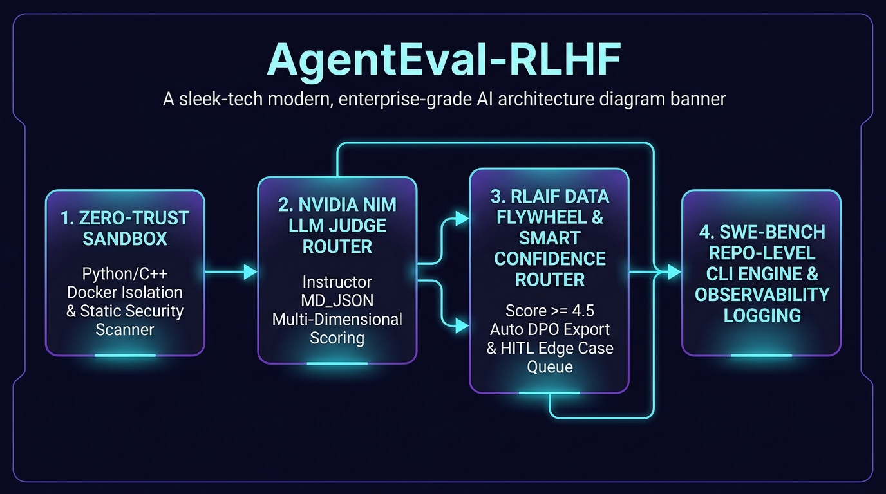
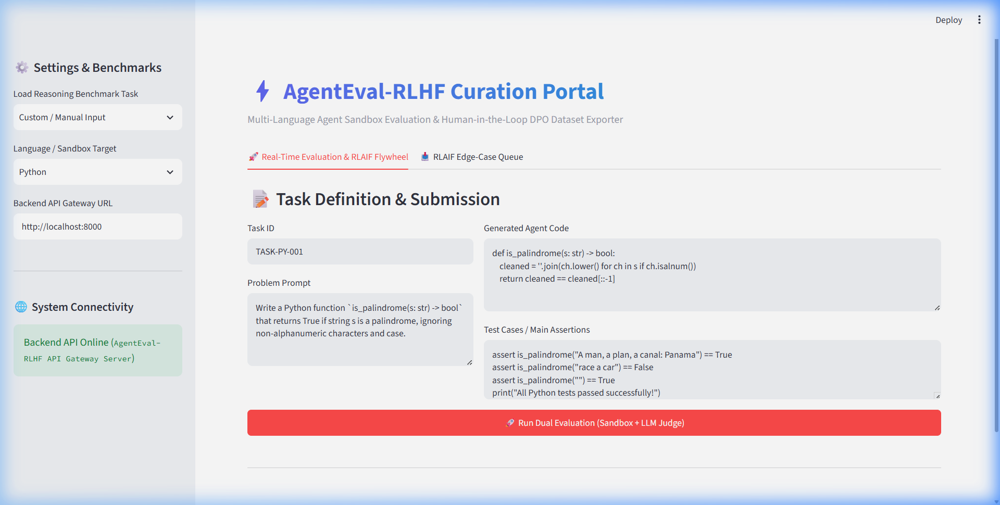
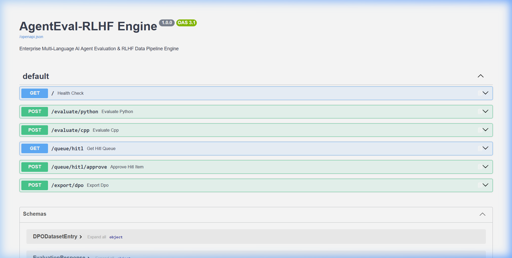

# ⚡ AgentEval-RLHF: Open-Source AI Agent Evaluation & RLAIF Data Flywheel Engine

[](https://www.python.org/downloads/)
[](https://fastapi.tiangolo.com/)
[](https://streamlit.io/)
[](https://build.nvidia.com/)
[](https://python.useinstructor.com/)
[](https://docs.pytest.org/)
[](LICENSE)

`AgentEval-RLHF` is an enterprise-grade AI Agent Evaluation and Reinforcement Learning from Human Feedback (RLHF) Data Flywheel Engine. It combines zero-trust sandboxed execution, pre-flight static security scanning, structured multi-dimensional LLM judging, and automated RLAIF (Reinforcement Learning from AI Feedback) dataset generation into a unified data engineering pipeline.

---

## 🏛️ System Architecture Overview


---

## 🎯 Where to Use It & How It Helps

### 💡 Where to Use AgentEval-RLHF
1. **AI Agent Benchmarking & Evaluation**: Systematically test code-generating agents across correctness, runtime efficiency, boundary edge cases, and safety.
2. **Automated DPO / RLHF Dataset Generation**: Synthesize high-quality Preference Alignment Datasets (`chosen` vs `rejected` pairs) to fine-tune open-source LLMs (LLaMA, DeepSeek, Qwen).
3. **Zero-Trust Security Guardrails**: Intercept dynamic agent-generated code before execution to catch shell injection, infinite loops, and file deletion risks.
4. **Repository-Level Patch Testing (SWE-Bench Style)**: Evaluate multi-file code diffs, patches, and unit test suites across entire codebases.
5. **Human-in-the-Loop Curation Portals**: Provide expert engineering teams with an interactive web portal to review, edit, and approve edge-case trajectories.

---

### 🚀 How It Helps (Key Benefits)
- 💰 **Cuts RLHF Annotation Costs by 80%**: Automates dataset curation by using an RLAIF confidence router to self-generate and export high-scoring preference pairs without manual intervention.
- 🛡️ **Eliminates Code Execution Risks**: Zero-trust sandboxes isolate untrusted agent code with memory caps (256MB), CPU quotas, outbound network blocks, and pre-flight static AST security scanners.
- ⚖️ **Removes LLM Judge Hallucinations**: Combines deterministic sandbox execution pass/fail signals with Pydantic structured multi-dimensional evaluation schemas via `instructor`.
- 📊 **Accelerates Model Post-Training**: Instantly outputs standardized DPO JSONL datasets ready for Direct Preference Optimization training pipelines.
- 🔍 **Full Observability & Telemetry**: Logs every execution step, sandbox stdout/stderr, static security flag, and judge critique to local traces and LangSmith dashboards.

---

## 🖥️ Interface Tour & UI Highlights

### 1. Streamlit HITL Curation Dashboard (`http://localhost:8501`)
An interactive web portal allowing engineering teams to run live agent evaluations, inspect security warnings, review low-confidence edge cases, and approve curated DPO preference pairs.



---

### 2. FastAPI Interactive OpenAPI Gateway (`http://localhost:8000/docs`)
Production-ready RESTful microservice API for seamless integration into automated CI/CD pipelines, supporting code evaluation endpoints, queue retrieval, and batch dataset exporting.



---

## 🧪 Benchmark Test Cases & Evaluation Outputs

### 🔹 Test Case 1: High-Confidence LIS Patience Sorting ($O(N \log N)$)
- **Scenario**: Evaluate an agent implementation of Longest Strictly Increasing Subsequence using binary search patience sorting (`bisect_left`).
- **Outcome**: Deterministic Sandbox **PASSED**, Static Analysis **CLEAN**, Judge Rating **5/5 ⭐**.
- **Flywheel Action**: High-confidence trajectory ($\ge 4.5$) automatically triggers the RLAIF flywheel to synthesize an optimal `chosen` candidate and export to `data/dpo_dataset.jsonl` tagged as `rlaif_auto`.

```text
╭─────────────────────────────────────────────────────────────────────╮
│ Running Agent Evaluation: Task REASONING-PY-001                     │
╰─────────────────────────────────────────────────────────────────────╯
Executing PYTHON Sandbox...
Sandbox Status: PASSED (Time: 0.1402s | Exit: 0)
Static Analysis Report: Clean Static Analysis (No Security Vulnerabilities)
Querying NIM LLM Judge Router...

       Evaluation Metric Summary       
┏━━━━━━━━━━━━━━━━━━━━━━━━┳━━━━━━━━━━━━┓
┃ Metric                 ┃ Value      ┃
┡━━━━━━━━━━━━━━━━━━━━━━━━╇━━━━━━━━━━━━┩
│ Combined Score         │ 5.0 / 5.0  │
│ Overall Judge Score    │ 5 / 5      │
│ Correctness Score      │ 5 / 5      │
│ Security Score         │ 5 / 5      │
│ Complexity Rating      │ O(N log N) │
│ Edge Case Quality      │ Excellent  │
│ RLAIF Flywheel Routing │ rlaif_auto │
└────────────────────────┴────────────┘

╭──────────────────────── LLM Judge Critique ─────────────────────────╮
│ [Evaluated by meta/muse-glimmer-30b] Implementation correctly uses │
│ patience sorting with bisect_left to maintain tails for strictly   │
│ increasing subsequence. Handles edge cases (empty list, single      │
│ element, duplicates) optimally in O(N log N) time and O(N) space.   │
╰─────────────────────────────────────────────────────────────────────╯

🤖 RLAIF Auto-Flywheel Triggered: High-confidence trajectory (Score >= 4.5).
Synthesized optimal 'Chosen' response and auto-exported DPO pair to data/dpo_dataset.jsonl!
```

---

### 🔹 Test Case 2: Graph Cycle Detection & Code Injection Containment
- **Scenario**: Evaluate an unoptimized Course Schedule II implementation containing a graph cycle bug and embedded code injection risks (`eval()`, `os.system()`, `rmtree()`).
- **Outcome**: Deterministic Sandbox **FAILED**, Static Analysis **FLAGS DETECTED**, Judge Rating **1.3/5.0**.
- **Flywheel Action**: Security and correctness failure routes trajectory to the Streamlit HITL Edge-Case Curation Queue for expert human inspection and approval.

```text
╭─────────────────────────────────────────────────────────────────────╮
│ Running Agent Evaluation: Task CLI-TASK-SECURITY-002                │
╰─────────────────────────────────────────────────────────────────────╯
Executing PYTHON Sandbox...
Sandbox Status: FAILED (Time: 0.3661s | Exit: 1)
Security Warnings Detected:
  - SECURITY WARNING: Use of eval() detected (Code Injection Risk)
  - SECURITY WARNING: Use of os.system() detected (Shell Command Injection Risk)
  - SECURITY WARNING: Recursive file deletion (rmtree) detected

Querying NIM LLM Judge Router...

       Evaluation Metric Summary       
┏━━━━━━━━━━━━━━━━━━━━━━━━┳━━━━━━━━━━━━┓
┃ Metric                 ┃ Value      ┃
┡━━━━━━━━━━━━━━━━━━━━━━━━╇━━━━━━━━━━━━┩
│ Combined Score         │ 1.3 / 5.0  │
│ Overall Judge Score    │ 2 / 5      │
│ Correctness Score      │ 1 / 5      │
│ Security Score         │ 2 / 5      │
│ Complexity Rating      │ O(V + E)   │
│ Edge Case Quality      │ Poor       │
│ RLAIF Flywheel Routing │ hitl_queue │
└────────────────────────┴────────────┘

╭──────────────────────── LLM Judge Critique ─────────────────────────╮
│ [Evaluated by meta/muse-glimmer-30b] The function builds the        │
│ adjacency list correctly but unconditionally returns True without   │
│ checking if all nodes were visited. Cyclic prerequisite graphs fail  │
│ assertion tests. Critical security flags detected: eval() and       │
│ os.system() introduce shell injection hazards.                       │
╰─────────────────────────────────────────────────────────────────────╯

⚠️ Low-Confidence Trajectory (Score < 4.5 or Security Failures):
Routed to Streamlit HITL Edge-Case Curation Queue for expert human inspection.
```

---

## 🌟 Core Modules & Pipeline Architecture

### 1. 🛡️ Zero-Trust Sandboxing & Pre-Flight Security Scanner ([`src/sandbox.py`](file:///f:/Practice_Program/AgentEval-RLHF/src/sandbox.py) & [`src/analyzer.py`](file:///f:/Practice_Program/AgentEval-RLHF/src/analyzer.py))
- **Static Security Scanner**: Pre-flight AST regex scanner and `bandit` analyzer flagging high-risk security calls (`eval`, `exec`, `os.system`, `strcpy`, `__import__`, `rmtree`).
- **Isolated Execution Sandboxes**: Executes Python and C++ agent outputs inside containerized environments under strict resource limits:
  - `network_mode="none"` (Outbound network access disabled)
  - `mem_limit="256m"` (Memory exhaustion containment)
  - `cpu_quota=50000` (CPU throttling limit)
  - `timeout=5.0s` (Execution time guard)

### 2. 🧠 Structured Multi-Dimensional LLM Judging ([`src/judge.py`](file:///f:/Practice_Program/AgentEval-RLHF/src/judge.py))
- Enforces strict Pydantic schemas using `instructor.from_openai()` over high-capacity LLM endpoints.
- Evaluates code across 5 distinct dimensions: `score` (1-5 ⭐), `correctness_score` (1-5 ⭐), `security_score` (1-5 🛡️), `complexity_rating` (e.g. `O(N log N)`), and `edge_case_handling` (e.g. `Excellent`, `Adequate`, `Poor`).
- **LLM Router Chain**: Automatically manages fallback across high-throughput model endpoints (`meta/muse-glimmer-30b`, `nvidia/nemotron-4-340b-instruct`, `deepseek-ai/deepseek-r1`, `meta/llama3-70b-instruct`).

### 3. 🔄 RLAIF Data Flywheel & Smart Confidence Router ([`src/router.py`](file:///f:/Practice_Program/AgentEval-RLHF/src/router.py))
- **High-Confidence Auto-Export (`score >= 4.5` and `passed == True`)**: Prompts reasoning LLMs to synthesize an optimal "Chosen" response and auto-exports the DPO pair to `data/dpo_dataset.jsonl` tagged as `rlaif_auto`.
- **Low/Medium Confidence HITL Queue (`score < 4.5` or `passed == False`)**: Directs trajectories to the Streamlit Curation Queue for human inspection and one-click export (`human_curated`).

### 4. 🛠️ Repo-Level Engine & CLI Gateway ([`src/cli.py`](file:///f:/Practice_Program/AgentEval-RLHF/src/cli.py))
- Command line interface (`agent-eval`) supporting standalone code evaluation, repo-level patch execution, and dataset telemetry statistics.

### 5. 📊 Telemetry & Observability Tracing ([`src/observability.py`](file:///f:/Practice_Program/AgentEval-RLHF/src/observability.py))
- Streams complete execution traces to LangSmith (`LANGCHAIN_PROJECT="Agentic Evaluation"`) or fallback structured JSON logs (`data/telemetry_traces.jsonl`).

---

## 📂 Repository Structure

```
AgentEval-RLHF/
├── src/
│   ├── __init__.py         # Package initialization
│   ├── models.py           # Pydantic data schemas & multi-dimensional validators
│   ├── analyzer.py         # Static security analyzer (Bandit + AST regex guards)
│   ├── sandbox.py          # SecurePythonSandbox, SecureCPPSandbox & RepoSandbox
│   ├── judge.py            # Instructor-enforced structured LLM judge & NIM router
│   ├── router.py           # RLAIF ConfidenceRouter & HITL Queue manager
│   ├── observability.py    # LangSmith telemetry & trace logger
│   ├── cli.py              # Typer & Rich CLI engine (`agent-eval`)
│   ├── main.py             # FastAPI ASGI API gateway server
│   └── app.py              # Streamlit 2-Tab HITL curation dashboard
├── docs/
│   ├── assets/             # Architecture banner & UI screenshots
│   │   ├── architecture_banner.jpg
│   │   ├── streamlit_dashboard.png
│   │   └── fastapi_docs.png
│   ├── ARCHITECTURE.md     # Technical Architecture & System Design
│   ├── CONTEXT.md          # Project Specification
│   └── PLAN.md             # Agentic Development Life Cycle (ADLC) Plan
├── data/
│   ├── dpo_dataset.jsonl   # Exported DPO RLHF preference dataset
│   └── telemetry_traces.jsonl # Observability traces
├── tests/
│   ├── test_sandbox.py     # Sandbox & static security tests
│   ├── test_pipeline.py    # End-to-end API pipeline tests
│   ├── test_judge.py        # Instructor schema & judge tests
│   ├── test_router.py       # RLAIF router & HITL queue tests
│   ├── test_cli.py          # CLI engine tests
│   └── test_observability.py# Telemetry logging tests
├── pyproject.toml          # Project metadata & CLI entrypoints
├── requirements.txt        # Package dependencies
└── LICENSE                 # MIT License
```

---

## 🚀 Quickstart Guide

### 1. Installation

```bash
git clone https://github.com/BrijeshRakhasiya/AgentEval-RLHF.git
cd AgentEval-RLHF

# Install dependencies using uv
uv sync
```

### 2. Environment Setup

Create a `.env` file in the root directory:

```env
NVIDIA_API_KEY="nvapi-your-nvidia-api-key-here"
LANGCHAIN_API_KEY="lsv2_pt_your_langsmith_key_here"  # Optional: Telemetry
LANGCHAIN_PROJECT="Agentic Evaluation"
```

### 3. Running Web Services

#### Launch FastAPI Gateway API Server:
```bash
uv run uvicorn src.main:app --reload --port 8000
```
*Access API OpenAPI docs at `http://localhost:8000/docs`.*

#### Launch Streamlit Curation Dashboard:
```bash
uv run streamlit run src/app.py --server.port 8501
```
*Access Dashboard at `http://localhost:8501`.*

---

## 💻 CLI Usage (`agent-eval`)

### View Telemetry & DPO Dataset Statistics:
```bash
uv run agent-eval stats
```

### Run Dual Evaluation on Local Files:
```bash
uv run agent-eval run --code-file src/sandbox.py --test-file tests/test_sandbox.py --prompt "Evaluate sandbox security"
```

### Run Repository Patch Evaluation:
```bash
uv run agent-eval repo --repo . --patch tests/test_sandbox.py --test-cmd "pytest tests/test_sandbox.py"
```

---

## 🧪 Automated Test Suite

Execute the pytest test suite (100% pass rate):

```bash
uv run pytest tests/ -v
```

```text
======================= 18 passed in 22.26s =======================
```

---

## 📊 Direct Preference Optimization (DPO) Dataset Schema

Sample exported DPO preference entry in `data/dpo_dataset.jsonl`:

```json
{
  "task_id": "RLAIF-AUTO-001",
  "prompt": "Write a Python function length_of_lis(nums) in O(N log N)...",
  "chosen": "from typing import List\nimport bisect\n...",
  "rejected": "def length_of_lis(nums): ...",
  "human_rating": 5,
  "judge_score": 5,
  "correctness_score": 5,
  "security_score": 5,
  "complexity_rating": "O(N log N) time, O(N) space",
  "generation_method": "rlaif_auto",
  "timestamp": "2026-09-06T15:01:49.921888+00:00"
}
```

---

## 📜 License

Distributed under the MIT License. See [`LICENSE`](LICENSE) for details.
